 

# ZAIN

*writing code like it's a masterwork, not a job*

 

---

 

**Most people optimize for busy.**
**I optimize for leverage.**

Fewer projects. Built deeper. Shipped louder.

 

---

 

### Right Now

  

 

`Building` → [project name]
 
`Studying` → [skill / domain]
 
`Thinking about` → [the idea currently living rent-free in your head]

 

---

 

### Tools of the Craft

`JavaScript` `Python` `React` `Node.js`

 

---

 

### The Work

**[Project Name](https://github.com/username/repo)**
What it is. Why it exists. What it proves.

**[Project Name](https://github.com/username/repo)**
What it is. Why it exists. What it proves.

 

---

 

*"Depth over noise. Signal over scale."*

[Twitter/X](#) · [Website](#) · [LinkedIn](#)

 

 

 

  

